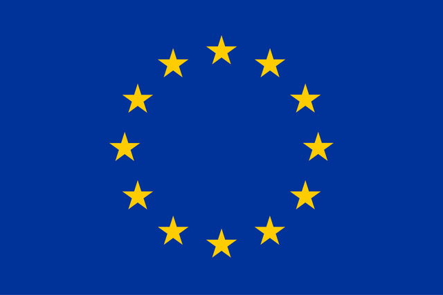
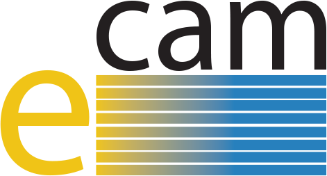

.. _acknowledgments:

===============
Acknowledgments
===============

OpenPathSampling would not be possible without the help of our beta testers
and the support of our funding agencies. 

Version 1.0
===========

OPS 1.0 had many beta testers. In particular, we'd like to thank those who
used OPS in research projects in collaboration with the developers, and
those who developed new tools that build on OPS during their participation
in E-CAM Extended Software Development Workshops (one held in Traunkirchen,
Austria in 2016, and one in Leiden, Netherlands, in 2017):

* Jony Castagna (STFC, Sci-Tech Daresbury Laboratory)
* Raffaella Cabriolu (Norwegian University of Science and Technology)
* Nicole de Groot (University of Amsterdam)
* Sonya Hanson (Memorial Sloan Kettering Cancer Center)
* Colm Herbert (University College Dublin)
* Hendrik Jung (Max Planck Institute for Biophysics)
* Anders Lervik (Norwegian University of Science and Technology)
* Anastasiia Maslechko (Norwegian University of Science and Technology)
* Donal MacKernan (University College Dublin)
* Sarah McCartan (University College Dublin)
* Clemens Moritz (University of Vienna)
* Alberto Pérez de Alba Ortíz (University of Amsterdam)
* Stefano Poggio (University College Dublin)
* Enrico Riccardi (Norwegian University of Science and Technology)
* Sander Roet (University of Amsterdam)
* Abel Sagodi (University of Amsterdam)
* Andreas Singraber (University of Vienna)
* Ariana Torres-Knoop (University of Amsterdam)
* Jocelyne Vreede (University of Amsterdam)
* Arjun Wadhawan (University of Amsterdam)

OPS 1.0 received funding from several sources, including:

+--------------+------------------------------------------------------------+
| |eu-flag|    | The European Union’s Horizon 2020 research and innovation  |
| |ecam-logo|  | programme, under the grant agreement No. 676531            |
|              | (`project E-CAM`_).                                        |
+--------------+------------------------------------------------------------+

.. _project E-CAM: https://www.e-cam2020.eu/
