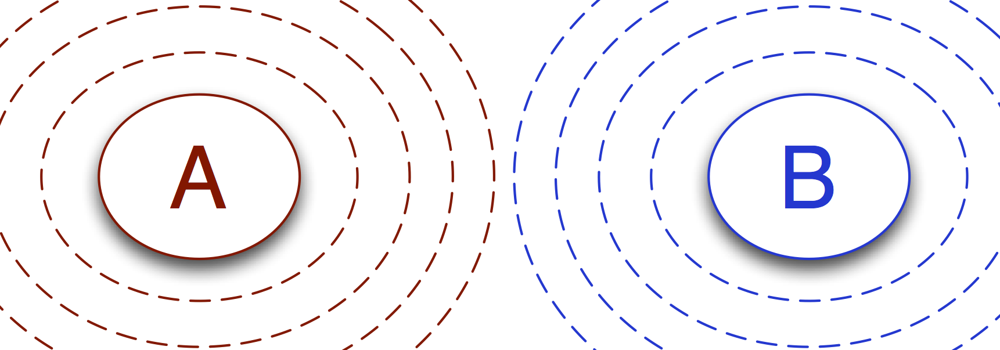
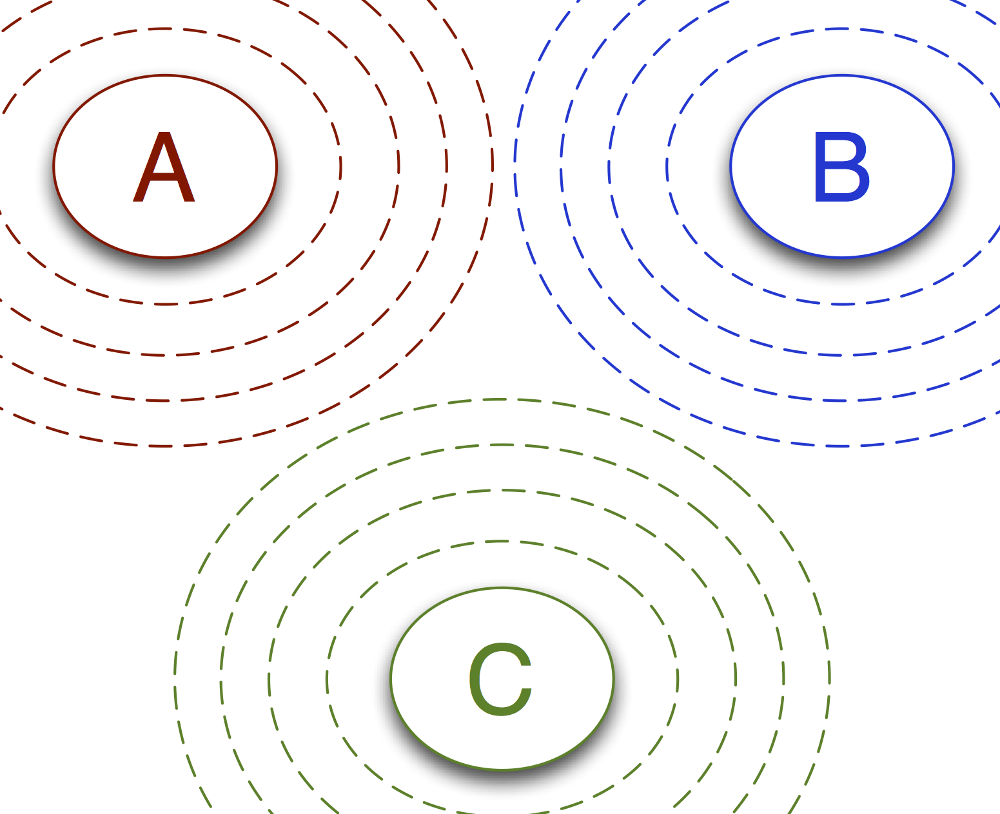

.. _transitions-and-networks:

========================
Transitions and Networks
========================

Different path sampling approaches use different kinds of ensembles. But
what they all share in common is that those ensembles represent some network
of transitions.

Under most circumstances, the user can directly work with
:class:`TransitionNetworks <.TransitionNetwork>`, and never needs to work
directly with :class:`Ensembles <.Ensemble>`.  This document describes the
internal structure of :class:`TransitionsNetworks <.TransitionNetwork>`, and
explains how to customize that structure with different ensembles if so
desired.

This also covers some of the interface between :class:`TransitionNetworks
<.TransitionNetwork>` and :py:class:`.MoveStrategy` objects. When developing
new methodologies, this interface allows for high levels of flexibility. A
new :class:`.TransitionNetwork` could be combined with a customized
:class:`.MoveStrategy` to develop all sorts of path-sampling-like
approaches.

:class:`Networks <.TransitionNetwork>` are made of :class:`Transitions <.Transition>`
=====================================================================================

A transition describes a set of paths with certain allowed initial and final
conditions. There are two groups of transitions that are important when
working with networks. First, there are the
:attr:`~.TransitionNetwork.sampling_transitions`, which are what are
actually sampled by the dynamics. Then there are
:attr:`~.TransitionNetwork.analysis_transitions` (or just
:attr:`~.TransitionNetwork.transitions`) which are the subjects of analysis.

The difference between these is easily described in the context of MSTIS.
With MSTIS, you use one set of ensembles to sample the transitions from a
given state to all other states. So you would sample :math:`A\to (B \text{ or }
C)`, but the analysis transitions would include separate studies of
:math:`A\to B` and :math:`A\to C`.

The network is defined by the combination of what the underlying transitions
to study are, and the approach used to study them. It defines a set of path
ensembles which are sampled during the dynamics, and the way to combine
those afterward into results that connect to physical meaning.

Handcrafting :class:`Networks <.TransitionNetwork>`
---------------------------------------------------

Beyond the simple tools to customize the networks you study, you can
manually create them with whatever complexity you desire. The
:class:`Network <.TransitionNetwork>` level of code is designed to interact
with the :class:`.MoveScheme` and :class:`.MoveStrategy` code, as well as
with some of the analysis tools. As long as
you implement a few items, your custom :class:`Network <.TransitionNetwork>`
will work seamlessly with those.

The main point is that there are two aspects of the network: there's the
sampling network, which is organizes the ensembles as used in sampling, and
the analysis network, which actually consists of the specific transitions
you're interested in studying.

Handcrafting the sampling network
~~~~~~~~~~~~~~~~~~~~~~~~~~~~~~~~~

The sampling network consists of three objects:

* :attr:`network._sampling_transitions
  <.TransitionNetwork._sampling_transitions>`: a list of transitions;
  contains all the normal ensembles (accessible as
  :attr:`network.sampling_transitions
  <.TransitionNetwork.sampling_transitions>`)
* :attr:`network.special_ensembles <.TransitionNetwork.special_ensembles>`:
  a dictionary with strings for keys, describing
  the type of ensemble, and dictionaries for values. Those value dictionaries
  have the ensembles themselves as keys, and a list of associated transitions as
  values.
* :attr:`network.hidden_ensembles <.TransitionNetwork.hidden_ensembles>`:
  this list is empty when built by the network, and is set by the MoveScheme
  if necessary. This consists of ensembles that aren't part of the network,
  but are part of the move scheme.

The special ensembles need to have the correct key names to work with the
:class:`.MoveScheme` and :class:`.MoveStrategy` subsystem. These are
``'minus'`` for the minus interfaces, and ``'ms_outer'`` for the multiple
state outer interfaces.

If you do that, then :class:`.MoveStrategy` and :class:`.MoveScheme` will
work with your networks.

Handcrafting the analysis network
~~~~~~~~~~~~~~~~~~~~~~~~~~~~~~~~~

The analysis network is determined by the list of all state pairs that
represent the transitions you're studying. It is contained in the
:class:`network.transitions <.TransitionNetwork.transitions>` dictionary,
which has keys of tuples in the form ``(stateA, stateB)`` with values of the
:class:`.Transition` object that describes the :math:`A\to B` transition.
During analysis calculations, you will often perform the analysis on the
sampling network, but copy the results of that analysis to the transition
network using
:meth:`analysis_transition.copy_analysis_from(sampling_transition)
<.Transition.copy_analysis_from>`.  For example, in MSTIS, you only run one
crossing probability analysis per state (per sampling transition), but this
is used to link to all the specific state-to-state transitions in the
analysis network.

Examples of Networks and Transitions
====================================

Two-state network
-----------------

It is perhaps easiest to understand the idea of networks and transitions if
we visualize them for the case of transition interface sampling. Let's take
one of the commonly-used illustrations of TIS as a starting point:

Here we see two transitions: :math:`A\to B` and :math:`B\to A`. In this
simple example, there is no distinction between sampling transitions and
analysis transitions. Each transition consists of several ensembles. The
ensembles define the paths that will actually be sampled during the path
sampling simulation. The transitions provide a context for analyzing those
results: in TIS, we combine results from sampling multiple ensembles in a
specific way in order to determine rates. The :class:`Transition` object
keeps the information on how to combine information from its various
ensembles.

In practice, this network can be created as either an :class:`.MSTISNetwork`
or a :class:`.MISTISNetwork`:

.. code-block:: python

   # mstis version 
   mstis = paths.MSTISNetwork([
       (stateA, interfacesAB, orderparameterAB),
       (stateB, interfacesBA, orderparameterBA)
   ])

   # mistis version
   mistis = paths.MISTISNetwork([
       (stateA, interfacesAB, orderparameterAB, stateB),
       (stateB, interfacesBA, orderparameterBA, stateA)
   ])

Both of these would give the same behavior.

Note that there are other approaches that could give different networks. By
default, both :class:`.MSTISNetwork` and :class:`.MISTISNetwork` create a
"multiple state outer interface," which links the two transitions. Whether
this interface is actually used depends on the :class:`.MoveScheme`:
however, another network type might not even make it. Similarly, the
transitions in both of these create a :class:`.MinusInterfaceEnsemble`,
which could be removed.

For simplicity, we recommend that users who wish to avoid making use of
these ensembles adjust the :class:`.MoveStrategy` and :class:`.MoveScheme`
to manage that, rather than creating a new :class:`.TransitionNetwork`.

Three-state networks
--------------------

Now let's consider a 3-state system. In the image below, we illustrate the
sampling network for an :class:`.MSTISNetwork` for a 3-state system.

In this example, there are 3 sampling transitions: 

* from state A, through the interfaces associated with A, and to either
  state B or state C
* from state B, through the interfaces associated with B, and to either
  state A or state C
* from state C, through the interfaces associated with C, and to either
  state A or state B

However, there are 6 analysis transitions: :math:`A\to B`, :math:`A\to C`,
:math:`B\to A`, :math:`B\to C`, :math:`C\to A`, and :math:`C\to B`. Each
sampling transition samples for two analysis transitions.

When you want a rate, you want the rate for the analysis transition. For
example, you would typically want a rate for the :math:`A\to B` process, not
the :math:`A\to (B \text{ or } C)` process, which is what the sampling
transition would give you. However, the sampling transitions can be much
more efficient to sampling: the number of analysis transitions scales as the
square of the number of states, while, in MSTIS, the number of sampling
transitions scales linearly with (actually, is equal to) the number of
states.

:class:`MISTISNetworks <.MISTISNetwork>`, on the other hand, have a sampling
transition for each analysis transition. This can give the advantage of
allowing a better order parameter to be used as an approximation to very
different reaction coordinates coming from the same state. It also allows
you to focus on only a subset of the :math:`N^2` possible transitions.

By distinguishing between sampling transitions and analysis transitions,
OpenPathSampling makes it easy to allow this kind of flexibility in the
underlying sampling style, while still making it very easy to set up a given
kind of network with minimal code.
