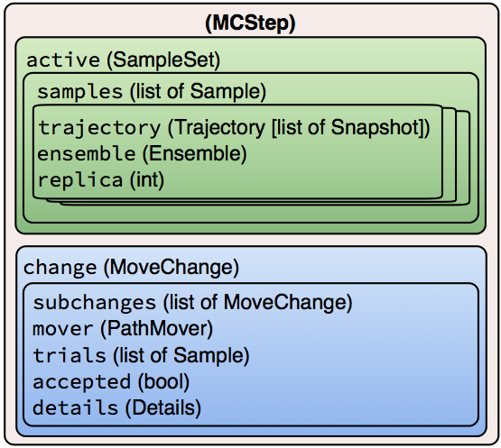

.. _data-objects:

.. currentmodule:: openpathsampling

============
Data objects
============

*Or: How do I see the trajectory I generated?*

OpenPathSampling stores everything it generates in a single file. This
includes the data generated by the simulation, as well as the objects
describing the simulation itself (enabling easy restarts). When we refer to
``storage``, we mean the storage subsystem, which deals with how these
things are written to a file. Most users are probably more interested in our
data objects, which are needed for performing custom analysis. The data
objects are described here.

   Hierarchical data structure of the MCStep data object. The attribute
   names are shown in fixed-width font, and the type is provided in
   parentheses.

The data structures used by OPS allow one to replay the entire simulation,
and this is generally the way we suggest performing analysis: loop over the
steps, in order, and extract the necessary information. The :class:`.MCStep`
object contains information about both the state of the simulation (the
trajectories being sampled) and details on the steps taken during the
simulation.  We thing of these as "what is sampled" and "how sampling
happens," respectively.

The :class:`.MCStep` has two important attributes: ``.active``, which
describes the current (active) state of the simulation at the end of the
given step, and ``.change``, which describes the process that occurred
during this step. These will be discussed in detail below.

.. note::

   Despite the name, :class:`.MCStep` is not only used for Monte Carlo. The
   same object is also used for other :class:`.PathSimulator` types, such as
   :class:`.CommittorSimulation`. Other simulation types still generate
   multiple trajectories, and so the split of "what was the state after this
   step" and "how was this step performed" still applies.

Objects describing what is sampled
----------------------------------

* :class:`Snapshots <.Snapshot>`, sometimes called "frames" or "time slices"
  are at the core of any simulation technique. They describe the state of
  the physical system at a point in time, and in molecular dynamics,
  typically consist of coordinates, velocities, and periodic cell vectors.
  The internal structure of a snapshot is discussed below.
* A :class:`.Trajectory`, also called a "path," is essentially a list of
  :class:`Snapshots <.Snapshot>` in temporal order. In addition, it provides
  several convenience methods, for example, to identify which
  :class:`Snapshots <.Snapshot>` are shared by two trajectories.
* The :class:`.Sample` object is a data structure that links a
  :class:`.Trajectory` with the :class:`.Ensemble` object from which it was
  sampled, and an integer replica ID. The :class:`.Sample` is needed because
  methods such as TIS, and especially RETIS, sample multiple ensembles
  simultaneously.  Correct analysis requires knowing the ensemble from which
  the :class:`.Trajectory` was sampled.
* Since methods like TIS have several active :class:`Samples <.Sample>`
  during a path simulation step, OPS collects them into one
  :class:`.SampleSet`. The :class:`.SampleSet` contains a list of
  :class:`Samples <.Sample>`, and also has convenience methods to access a
  sample either by replica ID or by ensemble, using the same syntax as a
  Python ``dict``.

Objects describing how sampling happens
---------------------------------------

* The :class:`.MoveChange` contains a record of what happened during the
  simulation step. Because the simulation move itself generally consists of
  several nested decisions (type of move, which ensemble to sample, etc.),
  the :class:`.MoveChange` object can contain subchanges, which record this
  entire sequence of decisions. In addition, it includes a pointer to its
  :class:`.PathMover`, a list of the trial :class:`Samples <.Sample>`
  generated during the step, and a boolean as to whether the trial move was
  accepted.
* The :class:`.MoveChange` also contains a :class:`.Details` object, which is
  essentially a dictionary to store additional metadata about a move. This
  metadata will vary depending on the type of move. For example, with a
  shooting move, it would include the shooting point. In principle, all the
  additional information that might be of interest for analysis should be
  stored in the :class:`.Details`.

Getting details for the move of interest
----------------------------------------

The ``change`` attribute of an :class:`.MCStep` covers the entire move,
including all the structural elements involved in making the decision. As
such, its details are very general, and not the details (such as shooting
point) that you are probably most interested in.

You can walk through the structural elements using the ``.subchanges``
attribute of a :class:`.MoveChange`, but in order to skip to the details
that you are most likely to be interested in, one :class:`.MoveChange` is
designated "canonical." For one-way shooting, the change from either the
forward or backward shot is canonical. The change from the replica exchange
mover or path reversal mover or minus mover is canonical.  The canonical
change is always within the nested ``subchanges`` of the
:class:`MoveChange`, but can be accessed directly with ``change.canonical``.
Note that this returns a :class:`.MoveChange`; to get the associated
:class:`.PathMover`, use ``change.canonical.mover``.  The
``change.canonical.details`` dictionary is where you can find the details of
what happened during this move.

Getting coordinates (etc.) from snapshots
-----------------------------------------

Of course, each ``Snapshot`` is a record consisting of several fields, or as
there are referred to in OPS, "features." Because OPS is independent of the
underlying engine (indeed, the engine need not represent molecular dynamics
at all), these features are engine-dependent. However, we recommend that
particle-based simulation engines use consistent feature names in order to
facilitate integration with tools in OPS and to simplify communication
between engines. These are the features we include for all particle-based
engines in OPS:

* ``coordinates``: Positions of the particles with units attached (for
  engines that have explicit units, such as OpenMM). List of list: the outer
  list loops over the atoms, while the inner list loops over spatial
  dimension (typically 3).
* ``xyz``: Positions of the particles without units attached. Same shape as
  ``coordinates``.
* ``velocities``: Velocities of the particles with units attached (for
  engines that have explicit units). Same shape as ``coordinates``.
* ``masses``: The masses of the system. Units (whether implicit or explicit)
  should be of actual mass, not mass/mole (as is often done in cases where
  energies are reported per mole). This may be used to calculate kinetic
  energy. Shape is the length of a 
* ``box_vectors``: Box vectors for a periodic system, or ``None`` if system
  is not periodic. This is usually a 3x3 matrix. OPS uses the same format as
  MDTraj.
* ``engine``: The engine instance that created this snapshot. Useful for
  checking provenance of data.

Note that implementation of these may by such that a single instance is used
by all snapshots. For example, all snapshots generated by a given engine
may share the same list of ``masses`` (in order to prevent redundant
storage). However, these are still accessible from the snapshot itself.

Engines with specific needs may include other features. For example,
wavefunction information might be included for an engine based on *ab
initio* dynamics. For other features, see the documentation for the specific
OPS engine wrapper.

For OPS engines that support it (including the OpenMM engine), trajectories
can be easily converted to `MDTraj <http://mdtraj.org>`_ trajectories with 
``mdtraj_trajectory = trajectory.to_mdtraj()``.  From there, one can use all
analysis tools in MDTraj, as well is its ability to write trajectories to
many file formats for input to other analysis programs. In addition, you can
use MDTraj as a gateway to other libraries: for example, its integration
with `nglview <https://github.com/arose/nglview/>`_ can be used for
molecular structure visualization.
