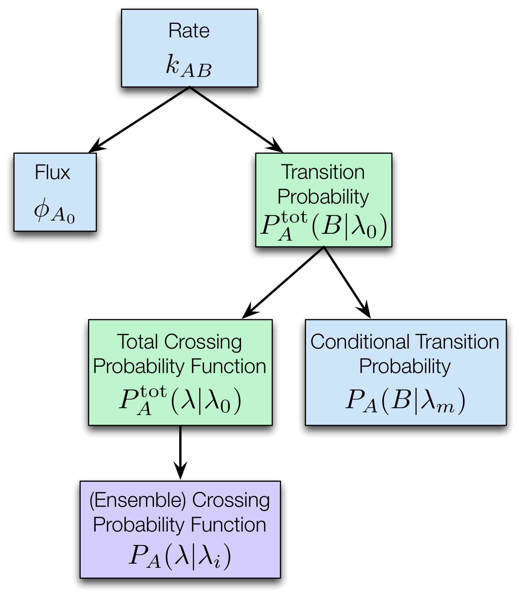

.. _tis-analysis:

============
TIS Analysis
============

OpenPathSampling tries to give reasonable default approaches to analyze
results from transition interface smapling. These defaults are run
through the :class:`.TransitionNetwork` objects, after using the
``rate_matrix`` method for that network. The main analysis sections of the
main examples show how to use the default analysis.

However, sometimes you may want to customize the analysis, or you may want
to develop new approaches to analyze the data. This document describes how
the analysis tools in ``openpathsampling.analysis.tis`` work.

.. note::

    Most of the presentation here is in terms of a simple :math:`A\to B`
    reaction network. For the most part, the generalization to multiple
    states is straightforward. When it isn't, we'll provide more details.

To start, let's look at way TIS calculates the rate. The fundamental
equation is:

.. math::

    k_{AB} = \phi_{A_0} P_A(B|\lambda_0)

where :math:`\phi_{A_0}` is the flux out of state :math:`A` and through
interface :math:`\lambda_0`, and the :math:`P_A(B|\lambda_0)` is the
conditional probability that a path ends in :math:`B` (before any other
state) given that it exits :math:`\lambda_0`. We refer to this conditional
probability as the "transition probability" for the transition :math:`A\to
B`. Note that the formally, :math:`\lambda` should also be labeled by the
interface set that it refers to (and in MSTIS, the state label is often used
to stand in for the only interface set). In the :math:`A\to B` transition,
there is only one interface set, so there is no possibility of confusion.

This equation focuses on the rate, but one of the important advantages of
TIS is that other quantities, such as projections of the committor
probability or of the free energy landscape, can be obtained from the same
information as the TIS rates by using the reweighted path ensemble.

All TIS simulations make this split. In the following, we'll discuss the
various ways to calculate the flux, and then we'll discuss approaches for
calculating the transition probability (which usually involves further
splitting). But first, let's introduce a glossary for the terminology and
mathematical notation to be used.

--------
Glossary
--------

+----------------+-------------------------+-------------------------------+
| Term           |  Math Notation          | Description                   |
+================+=========================+===============================+
| flux           | :math:`\phi_{A_0}`      | frequency at which a path     |
|                |                         | starting in :math:`A` crosses |
|                |                         | the innermost interface       |
|                |                         | :math:`\lambda_0`             |
+----------------+-------------------------+-------------------------------+
| transition     | :math:`P^\text{tot}_A(B | probability that a path that  |
| probability    | | \lambda_0)`           | starts in :math:`A` and       |
|                |                         | crosses the innermost         |
|                |                         | interface :math:`\lambda_0`   |
|                |                         | will next hit state :math:`B` |
+----------------+-------------------------+-------------------------------+
| (ensemble)     | :math:`P_A(\lambda |    | probability that a path that  |
| crossing       | \lambda_i)`             | starts in :math:`A` and       |
| probability    |                         | crosses (is sampled from)     |
| function       |                         | interface :math:`\lambda_i`   |
|                |                         | reaches :math:`\lambda`       |
+----------------+-------------------------+-------------------------------+
| total crossing | :math:`P^\text{tot}_A(  | probability (calculated       |
| probability    | \lambda | \lambda_0)`   | from all data) that a path    |
| function       |                         | that starts in state          |
|                |                         | :math:`A` and crosses the     |
|                |                         | innermost interface           |
|                |                         | :math:`\lambda_0` will        |
|                |                         | reach :math:`\lambda`         |
+----------------+-------------------------+-------------------------------+
| conditional    | :math:`P_A( B |         | probabiility that a path that |
| transition     | \lambda_m)`             | starts in :math:`A` and       |
| probability    |                         | crosses (is sampled from)     |
|                |                         | interface :math:`\lambda_m`   |
|                |                         | will next hit state :math:`B` |
+----------------+-------------------------+-------------------------------+

The probabilities above can be separated along two axes. The first is
whether the are a crossing probability (a function of some order parameter
:math:`\lambda`) or a transition probability (a number indicating the
probability of ending in some state). The second axis is whether they are
directly sampled during the simulation, or whether they are calculated from
the full simulation data. This distinction is illustrated in the table
below.

+-------------+--------------------------+---------------------------------+
|             |  Crossing probability    |  Transition probability         |
|             |  function                |                                 |
+=============+==========================+=================================+
| **Sampled** | :math:`P_A(\lambda |     | :math:`P_A(B | \lambda_m)`      |
|             | \lambda_i)`              |                                 |
+-------------+--------------------------+---------------------------------+
| **Total**   | :math:`P^\text{tot}_A(   | :math:`P^\text{tot}_A(B | A_0)` |
|             | \lambda | \lambda_0)`    |                                 |
+-------------+--------------------------+---------------------------------+

In the limit of infinite sampling, the sampled and calculated versions
should be identical. That is, the crossing probability sampled from
interface :math:`\lambda_0`, :math:`P_A(\lambda | A_0)`, would equal the
total crossing probability :math:`P^\text{tot}_A(\lambda | A_0)`. And
similarly, the conditional transition probability sampled from
:math:`\lambda_0`, :math:`P_A(B | \lambda_0)`, would equal the total
transition probability :math:`P^\text{tot}_A(B|\lambda_0)`.

Of course, the entire point of TIS is that infinite sampling is not
possible. In fact, the very definition of the transition being a rare event
is that, under feasible sampling, :math:`P_A(B | \lambda_0) \approx 0`. By
sampling multiple path ensembles, TIS allows us to get a good estimate for
:math:`P_A(B|\lambda_0)` with much less sampling effort.

We typically only discuss the "total" examples (both total crossing
probability and total transition probability) with the innermost interface
as the condition. When it comes to the (sampled) conditional transition
probability, we typically use the outermost interface (traditionally denoted
with the subscript :math:`m`).

For simple cases, the value of :math:`\lambda` is the sole feature defining
both states. In that case, the transition probabilites are equivalent to
crossing probabilities evaluated at :math:`\lambda = \lambda_B`. However, in
most realistic systems :math:`\lambda` only serves as an estimate of
reaction progress, and the actual state definitions include additional
requirements.

-----

--------------------
Calculating the flux
--------------------

We provide two main approaches for calculating the flux. The first approach
is to directly calculate the flux, using either the
:class:`.DirectSimulation` or :class:`.TrajectoryTransitionAnalysis` tools
in OPS. This is relatively simple, and since you are likely to have run MD
to ensure that your state is stable (and to select a location for the
innermost interface), it is likely that you'll already have enough data to
get very precise results. When doing this, you'll use the :class:`.FluxDict`
object to store the flux.

The second approach is to calculate the flux using the minus interface. This
isn't possible if there is more than one interface set per initial state (as
with MISTIS). This approach also tends to give larger errors; usually, you
try to minimize how often you do the minus move, which reduces the
statistics in this approach. However, this *is* the default (when possible),
and can be explicitly selected by using the :class:`.MinusMoveFlux`
object.

* TODO: Example using ``DirectSimulation`` to determine the flux
* TODO: Example using ``TrajectoryTransitionAnalysis`` to determine the flux
* TODO: Example using ``MinusMoveFlux`` to determine the flux

--------------------------------------
Calculating the transition probability
--------------------------------------

The other part of the TIS equation is the transition probability. This is
where we actually get into TIS-specific analysis. In TIS, as with many
"splitting" methods, the overall transition probability is broken into
smaller transitions between different waypoints ("interfaces" in TIS
terminology):

.. math::

    P^\text{tot}_A(B|\lambda_0) = \prod_{0}^{m-1} 
                                  P_A(\lambda_{i+1}|\lambda_{i})\ 
                                  P_A(B|\lambda_m)

There are a few ways that this can be calculated. What we term the
"standard" approach involves calculating the crossing probability
:math:`P_A(\lambda | \lambda_i)` for each interface :math:`\lambda_i`, and
using a combining procedure (WHAM by default) to create the total crossing
probability :math:`P^\text{tot}_A(\lambda | \lambda_0)`, and then use
:math:`\prod_0^{m-1} P_A(\lambda_{i+1}|\lambda_i) =
P^\text{tot}_A(\lambda=\lambda_{m} | \lambda_0)`.  The superscript "tot" is
to distinguish the total crossing probability, which is computed based on
all ensembles, from the crossing probability sampled from ensemble
:math:`\lambda_0` (see below). Finally, we calculate
:math:`P_A(B|\lambda_m)` (the "conditional crossing probability" to
:math:`B`, given interface :math:`\lambda_m`), and multiply these to get to
transition probability.

Other approaches include the path-type analysis, and per-ensemble histograms
(i.e., a coarser estimate of :math:`P(\lambda|\lambda_0)`, only obtaining
estimates when :math:`\lambda` is at an interface boundary.) These have not yet
been implemented in OPS, but will be soon.

Total crossing probability
==========================

As discussed above, the quantity :math:`\prod_0^{m-1}
P_A(\lambda_{i+1}|\lambda_i)` is calculated from the total crossing
probability :math:`P^\text{tot}_A(\lambda | \lambda_0)`.  In particular, it
is determined from the individual ensemble crossing probabilities
:math:`P_A(\lambda | \lambda_i)`, which are sampled during the simulation.

Conditional transition probability
==================================

The conditional transition probability is :math:`P(B|\lambda_m)`, the
probability of reaching state :math:`B` given that the path was sampled from
the outermost interface, :math:`\lambda_m`. Note that, in the case of
multiple states, the only difference between calculating the rate for
:math:`A\to B` and :math:`A\to C` is that the conditional transition
probability changes.

* Example manually setting up ``StandardTransitionProbability``

------------------------------------------------------
Putting it all together: :class:`.TISAnalysis` objects
------------------------------------------------------

As discussed previously, the full TIS analysis always involves splitting the
rate into flux and transition probability. The :class:`.TISAnalysis` objects
maintain this split, and also cache the results from other parts of the
analysis. This caching is useful both to speed up the overall analysis and
to provide access to intermediate results for further investigation.

The plain :class:`.TISAnalysis` object just requires a flux calculation and
a transition probability calculation. However, when performing analysis
according to the "standard" approach, it is better to use the
:class:`.StandardTISAnalysis` class. This caches several results, and is
therefore much more efficient than manually setting up the same approach
using a plain :class:`.TISAnalysis` object.

There are many options for setting up the :class:`.StandardTISAnalysis`; see
the documentation of that class for more details. A few simple examples are
shown in the following example notebook:

* TODO: examples with ``StandardTISAnalysis``

-------------------------------------------------
Summary: Visual overview of the standard analysis
-------------------------------------------------

In the image below, we provide a visual overview of the standard analysis.
Each box represents a specific part of the calculation, and the name, as
well as mathematical symbol, are included in the box. The color of the box
indicates how many of these objects there are in the OPS standard analysis:
blue boxes indicate one per reaction network, green boxes indicate one per
transition, and purple boxes indicate one per ensemble.

